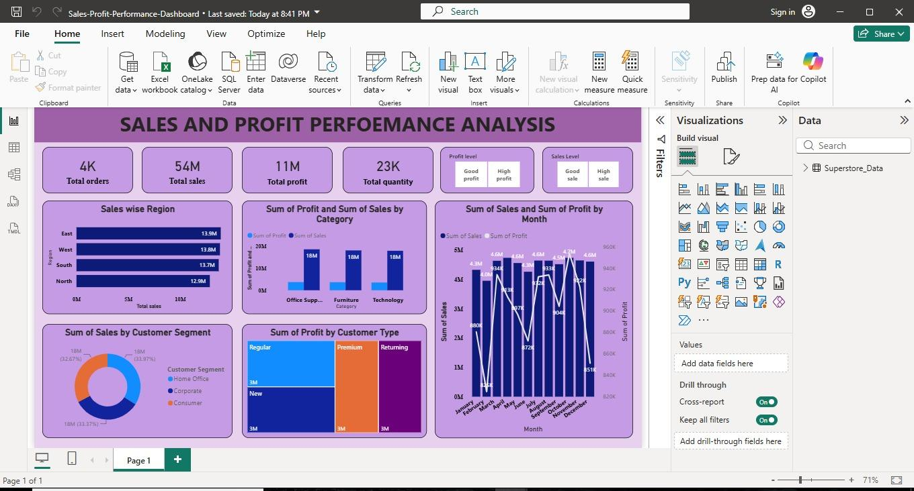

# Sales & Profit Performance Dashboard

## Description
This project is an interactive Power BI dashboard developed using the Superstore dataset to analyze sales, profit, customer segments, regional performance, and monthly trends.

## Features
- KPI Cards
- Region-wise Sales Analysis
- Category-wise Sales & Profit
- Customer Segment Analysis
- Monthly Sales Trend
- Interactive Filters & Slicers

## Tools Used
- Power BI
- Power Query
- DAX
- Microsoft Excel

## Dashboard Preview

## Author
Kanishkaa R
